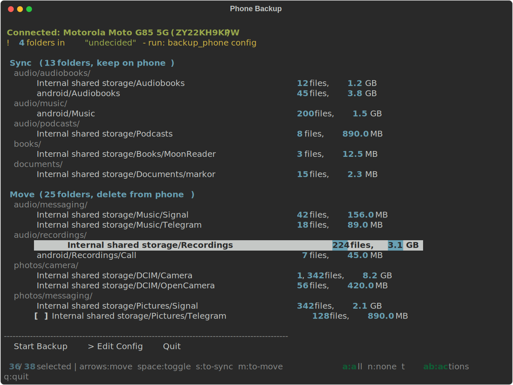
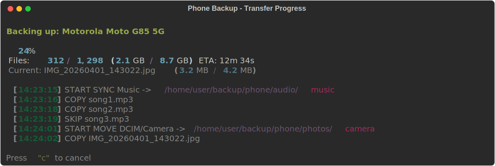
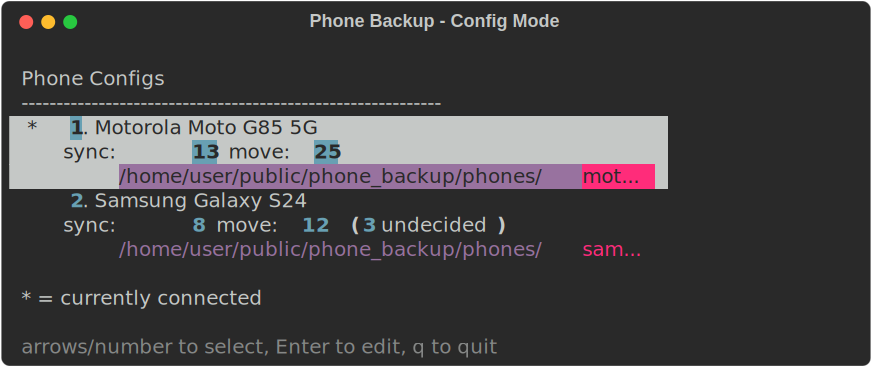

# Phone Backup

A terminal tool for backing up Android phones over USB (MTP).
Connect your phone, run the tool, select folders, and go.

## Features

- Detects MTP-connected Android phones automatically
- Per-phone YAML config with sync (keep on phone) and move (delete from phone) modes
- Interactive terminal UI with keyboard navigation
  - Arrow keys to browse, spacebar to toggle, s/m to reassign folders between sections
  - Folder sizes scanned in background
  - Progress bar with ETA during transfers
- Safe transfers: copies to temp file first, verifies size, then renames. Source files are never deleted until the copy is confirmed.
- Incremental: skips files already backed up (same name and size)
- Config editor mode to manage multiple phones

## Screenshots

### Backup UI

Select folders to sync or move, grouped by destination:



### Transfer Progress

Progress bar with file counts, sizes, ETA, and live log:



### Config Mode

Pick a phone to edit its config (`backup_phone config`):



## Quick Start

Install dependencies:

```bash
pip install -r requirements.txt
```

Connect phone in file transfer (MTP) mode, then run:

```bash
python phone_backup.py
```

First run auto-detects your phone and creates a config file. Your editor opens so you can sort folders into sync or move sections. Subsequent runs show the folder list. Select what to back up and press Start.

## Usage

```bash
python phone_backup.py          # Main backup interface
python phone_backup.py config   # Edit phone configs
```

## Keyboard Controls

| Key | Action |
|---|---|
| Up/Down | Move between folders |
| Space | Toggle folder selection |
| s | Move folder to sync section |
| m | Move folder to move section |
| a | Select all |
| n | Deselect all |
| Tab | Switch between folder list and actions |
| Left/Right | Move between actions |
| Enter | Activate action or toggle folder |
| q | Quit |

## Config Files

Each phone gets a YAML config in the `phones/` directory. See [docs/example_config.yaml](docs/example_config.yaml) for the format.

Three sections:
- **sync**: backup and keep on phone
- **move**: backup and delete from phone
- **undecided**: not yet categorized (shown as warning in the UI)

The `phones/` directory is a private git submodule. To set up your own:

1. Create a private repo on GitHub
2. `git submodule add <your-repo-url> phones`
3. Or just create a `phones/` directory locally (it works without being a submodule)

## Configuration

Edit the top of `phone_backup.py` to change:

- `BACKUP_BASE`: where backups go (default: `~/backup/`)
- `PHONES_DIR`: where phone configs live (default: `./phones/`)

## Project Structure

```
phone_backup.py          # main script with terminal UI
detector.py              # MTP phone detection via GVFS
config_manager.py        # YAML config management and folder mapping
transfer.py              # safe file transfer engine with progress
phones/                  # per-phone config files (private submodule)
docs/example_config.yaml # sample config for reference
tests/                   # test suite (33 tests)
```

## Requirements

- Python 3.12+
- PyYAML
- Linux with GVFS (for MTP phone access)
